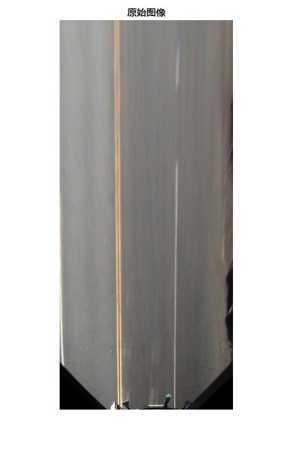
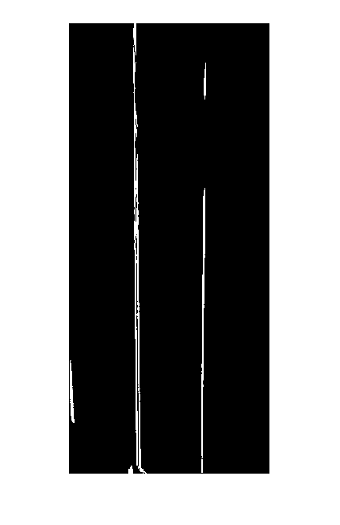

# 基于BEV(birds eye view)图像的车道线特征检测

[](https://matlab.mathworks.com/open/github/v1?repo=cuixing158/segmentLaneMarkerRidge)

**粗糙、简单、有效**的车道线特征检测算法实现，算法原理请参阅文后的References。改编自内建函数[segmentLaneMarkerRidge](https://ww2.mathworks.cn/help/driving/ref/segmentlanemarkerridge.html)，无需配置相机内外参，直接从BEV图像检测出车道线特征的二值图像。本函数优点在于扩展函数 segmentLaneMarkerRidge的适用场合不足，特别在未知的[birdsEyeConfig参数](https://ww2.mathworks.cn/help/driving/ref/segmentlanemarkerridge.html#bvkw2zz-1-birdsEyeConfig)情况下，仍然可以正常检测车道线特征。

# 示例
```matlab
bevImage = imread("images/birdsEyeImage.png");
figure;imshow(bevImage);
title("原始图像")
```



```matlab

pixelWidthInBEVImage = 5; % 图像中近似车道线宽度，单位：像素
birdsEyeBW = detectLaneMarkerRidge(bevImage,pixelWidthInBEVImage);
figure;imshow(birdsEyeBW)
```


# References

[1] [segmentLaneMarkerRidge](https://ww2.mathworks.cn/help/driving/ref/segmentlanemarkerridge.html)


[2] Nieto, M., J. A. Laborda, and L. Salgado. “Road Environment Modeling Using Robust Perspective Analysis and Recursive Bayesian Segmentation.” *Machine Vision and Applications.* Volume 22, Issue 6, 2011, pp. 927–945.

